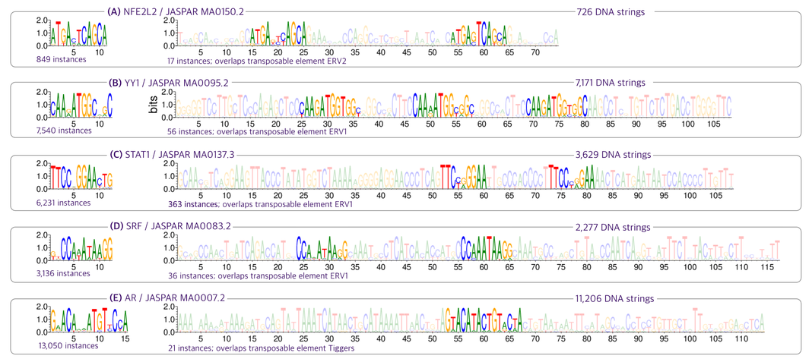
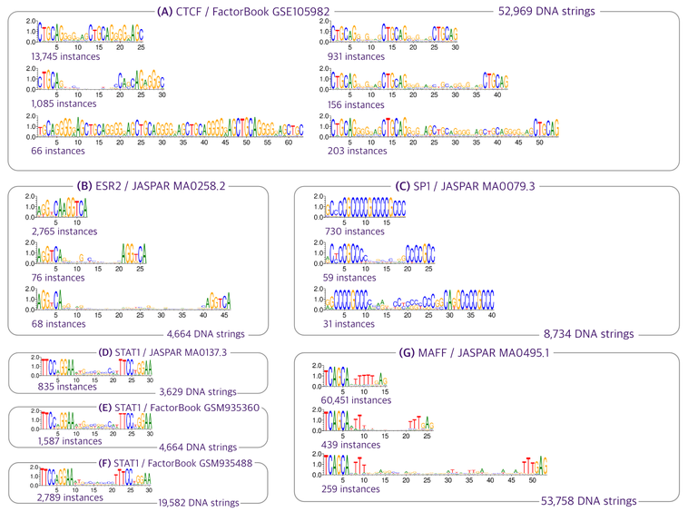
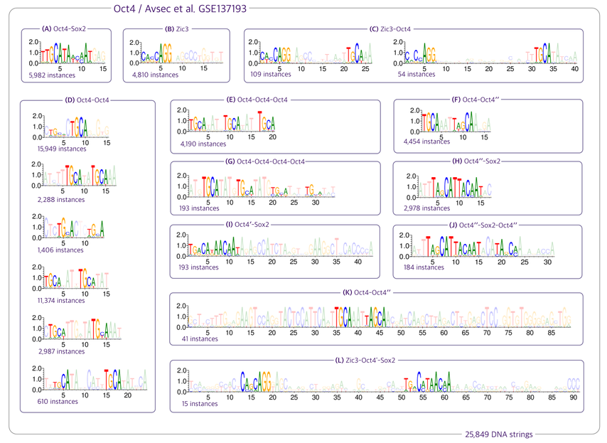

# Finding Motifs Using DNA Images Derived From Sparse Representations

[](https://kchu25.github.io/MOTIFs.jl/stable/)
[](https://kchu25.github.io/MOTIFs.jl/dev/)
[](https://github.com/kchu25/MOTIFs.jl/actions/workflows/CI.yml?query=branch%3Amain)
[](https://codecov.io/gh/kchu25/MOTIFs.jl)

General purpose motif discovery package that includes the discovery of flexible (long or gapped) motifs. 

The paper presenting this method has been published in [Oxford Bioinformatics](https://academic.oup.com/bioinformatics/advance-article-abstract/doi/10.1093/bioinformatics/btad378/7192989?utm_source=advanceaccess&utm_campaign=bioinformatics&utm_medium=email).

# Motivation
Traditional methods such as [STREME](https://meme-suite.org/meme/doc/streme.html) and [HOMER](http://homer.ucsd.edu/homer/motif/) excel at efficiently finding the primary motifs of a transcription factor. This begs the question -- why do we need another motif discovery method?

Because there may be more patterns in the datasets that aren't fully captured. This is even more so in in-vivo datasets such as ChIP-Seq.

Our work finds that more than half the selected ChiP-Seq datasets that we've examined from [JASPAR 2022](https://jaspar.genereg.net/) containes transposable elements that overlaps the primary binding sites. For instance, [NFE2L2](https://en.wikipedia.org/wiki/NFE2L2), [YY1](https://en.wikipedia.org/wiki/YY1), [STAT1](https://en.wikipedia.org/wiki/STAT1), [SRF](https://en.wikipedia.org/wiki/Serum_response_factor), [AR](https://en.wikipedia.org/wiki/Androgen_receptor) exhibit overlaps with transposable elements ([Manuscript Figure 4](https://academic.oup.com/bioinformatics/advance-article-abstract/doi/10.1093/bioinformatics/btad378/7192989?utm_source=advanceaccess&utm_campaign=bioinformatics&utm_medium=email)):



These long patterns pose challenges for traditional k-mer-based methods as space complexity is exponential.

Furthermore, many datasets exhibit a large presence of gapped motifs. For example, we found that ChIP-Seq datasets from both [JASPAR](https://jaspar.genereg.net/) and [Factorbook](https://www.factorbook.org/) often contains gapped motifs ([Manuscript Figure 6](https://academic.oup.com/bioinformatics/advance-article-abstract/doi/10.1093/bioinformatics/btad378/7192989?utm_source=advanceaccess&utm_campaign=bioinformatics&utm_medium=email)):



and the spacers that characterized the gapped motifs [can be widely varied (Supplementary Material Figure 2)](./imgs/gaps.png).

Last, there may be cooperative binding patterns, e.g., ([Manuscript Figure 5](https://academic.oup.com/bioinformatics/advance-article-abstract/doi/10.1093/bioinformatics/btad378/7192989?utm_source=advanceaccess&utm_campaign=bioinformatics&utm_medium=email)):




for which we see consecutive occurrences of [Oct4](https://en.wikipedia.org/wiki/Oct-4) and cooccurrence of [Oct4](https://en.wikipedia.org/wiki/Oct-4) and [Zic3](https://en.wikipedia.org/wiki/ZIC3). The presence of gapped motifs and cooperative binding patterns presents challenges for k-mer-based methods, as these methods are primarily designed to detect ungapped motifs.


# Installation
To install MOTIFs.jl use Julia's package manager:
```
pkg> add MOTIFs
```

# Usage
````julia
using MOTIFs

# Do motif discovery on a set of DNA sequences in a fasta file, 
# where the `<fasta-path>` and `<output-folder-path>` are the 
# absolute filepaths as strings.

discover_motifs(<fasta-path>, <output-folder-path>)

# for example
discover_motifs("home/shane/mydata/fasta.fa", 
                "home/shane/mydata/out/")
````

# Interpret the results
(coming soon)


# Software requirements 
 This package currectly requires [Weblogo](http://weblogo.threeplusone.com/manual.html#download) for PWM plotting. Install Weblogo by running the following command with python3 and pip3:
 ```bash
 pip3 install weblogo
 ```

# Hardware requirements
Currently, a GPU is required for this package as it utilizes [CUDA.jl](https://github.com/JuliaGPU/CUDA.jl) to accelerate certain computations. However, I plan to implement a CPU extension in the future.


# Adjustable Hyperparameters
````julia

# The user can adjust the number of epochs for training the network.
discover_motifs(<fasta-path>, <output-folder-path>; num_epochs=10)

````

# Citation <a name="cite"></a>

You can cite this work using the following BibTex entry:
```
@article{chu2023finding,
  title={Finding Motifs Using DNA Images Derived From Sparse Representations},
  author={Chu, Shane K and Stormo, Gary D},
  journal={Bioinformatics},
  pages={btad378},
  year={2023},
  publisher={Oxford University Press}
}
```

# Contact

If you have any questions or suggestions regarding the usage or source code, please feel free to reach out to me at <skchu@wustl.edu>.