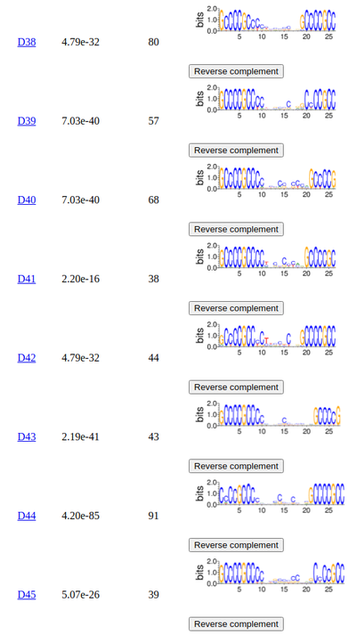

## Finding Motifs Using DNA Images Derived From Sparse Representations

<!-- [](https://kchu25.github.io/MOTIFs.jl/stable/)
[](https://kchu25.github.io/MOTIFs.jl/dev/)
[](https://github.com/kchu25/MOTIFs.jl/actions/workflows/CI.yml?query=branch%3Amain) -->

General purpose motif discovery package that includes the discovery of flexible (long or gapped) motifs. 

This code repository corresponds to the paper [Finding Motifs Using DNA Images Derived From Sparse Representations](https://academic.oup.com/bioinformatics/advance-article-abstract/doi/10.1093/bioinformatics/btad378/7192989?utm_source=advanceaccess&utm_campaign=bioinformatics&utm_medium=email), which has been published in Oxford Bioinformatics.

## Table of contents

- [Motivation](#Motivation)
- [Installation](#Installation)
- [Usage](#Usage)
- [Software requirements](#Software-requirements)
- [Hardware requirements](#Hardware-requirements)
- [Adjustable Hyperparameters](#Adjustable-Hyperparameters)
- [Interpret the results](#Interpret-the-results)
- [Cite this work](#Cite-this-work)
- [Contact](#Contact)


## Motivation
Traditional methods such as [STREME](https://meme-suite.org/meme/doc/streme.html) and [HOMER](http://homer.ucsd.edu/homer/motif/) excel at efficiently finding the primary motifs of a transcription factor. This raises the question: why do we require an additional motif discovery method?

Because there may be more patterns in the datasets that aren't fully captured. This is especially evident for context-dependent binding sites, such as C2H2 zinc finger, and cooperative binding patterns observed in in-vivo datasets from ChIP-Seq.

Our work reveals that over half of the ChIP-Seq datasets selected from the [JASPAR 2022](https://jaspar.genereg.net/) database contain transposable elements that overlap the primary binding sites. For instance, see [NFE2L2](https://en.wikipedia.org/wiki/NFE2L2), [YY1](https://en.wikipedia.org/wiki/YY1), [STAT1](https://en.wikipedia.org/wiki/STAT1), [SRF](https://en.wikipedia.org/wiki/Serum_response_factor), [AR](https://en.wikipedia.org/wiki/Androgen_receptor) ([Manuscript Figure 4](https://academic.oup.com/bioinformatics/advance-article-abstract/doi/10.1093/bioinformatics/btad378/7192989?utm_source=advanceaccess&utm_campaign=bioinformatics&utm_medium=email)):


These long patterns present challenges for traditional k-mer-based methods due to their exponential space complexity.

Furthermore, many datasets exhibit a large presence of gapped motifs. For example, we found that ChIP-Seq datasets from both [JASPAR](https://jaspar.genereg.net/) and [Factorbook](https://www.factorbook.org/) often contains gapped motifs ([Manuscript Figure 6](https://academic.oup.com/bioinformatics/advance-article-abstract/doi/10.1093/bioinformatics/btad378/7192989?utm_source=advanceaccess&utm_campaign=bioinformatics&utm_medium=email)):


and the spacers that characterized the gapped motifs [can be widely varied (Supplementary Material Figure 2)](./imgs/gaps.png).

Last, there are cooperative binding patterns, e.g., ([Manuscript Figure 5](https://academic.oup.com/bioinformatics/advance-article-abstract/doi/10.1093/bioinformatics/btad378/7192989?utm_source=advanceaccess&utm_campaign=bioinformatics&utm_medium=email)):


for which we see consecutive occurrences of [Oct4](https://en.wikipedia.org/wiki/Oct-4) and cooccurrence of [Oct4](https://en.wikipedia.org/wiki/Oct-4) and [Zic3](https://en.wikipedia.org/wiki/ZIC3), in addition to the Oct4-Sox2 motif. The presence of gapped motifs and cooperative binding patterns presents challenges for k-mer-based methods as well, as these methods are primarily designed to detect ungapped motifs.


## Installation
To install MOTIFs.jl use Julia's package manager:
```
pkg> add MOTIFs
```

## Usage
In Julia:
````julia
using MOTIFs

# Do motif discovery on a set of DNA sequences in a fasta file, 
# where the `<fasta-path>` and `<output-folder-path>` are the 
# absolute filepaths as strings.

discover_motifs(<fasta-path>, <output-folder-path>)

# for example
discover_motifs("home/shane/mydata/fasta.fa", 
                "home/shane/mydata/out/")
````

## Software requirements 
 This package currectly requires [Weblogo](http://weblogo.threeplusone.com/manual.html#download) for PWM plotting. Install Weblogo by running the following command with python3 and pip3:
 ```bash
 pip3 install weblogo
 ```

## Hardware requirements
Currently, a GPU is required for this package as it utilizes [CUDA.jl](https://github.com/JuliaGPU/CUDA.jl) to accelerate certain computations. However, I plan to implement a CPU extension in the future.


## Adjustable Hyperparameters
````julia

# The user can adjust the number of epochs for training the network.
discover_motifs(<fasta-path>, <output-folder-path>; num_epochs=10)

````
## Interpret the results

### Summary page
Once the motif discovery process is complete, a summary.html page is generated in the output folder, providing a comprehensive overview of the results.

For instance, here is an example result page showcasing data from the  [SP1 transcription factor from JASPAR](https://jaspar.genereg.net/matrix/MA0079.3/):

> 

The top of the result page has
- **Number of sequences**: The total number of DNA sequences in the dataset.
- **Label**: A label assigned for each discovered motifs.
    * Each label is hyperlinked to a text file in TRANSFAC format that can be parsed.
- **P-value**: The satistical significance of the discovered motif using Fisher exact test ([Manuscript section 2.7.2](https://academic.oup.com/bioinformatics/advance-article-abstract/doi/10.1093/bioinformatics/btad378/7192989?utm_source=advanceaccess&utm_campaign=bioinformatics&utm_medium=email)).
- **\# instances**: An estimate of the number of occurrences in the dataset ([Manuscript section 2.7.3](https://academic.oup.com/bioinformatics/advance-article-abstract/doi/10.1093/bioinformatics/btad378/7192989?utm_source=advanceaccess&utm_campaign=bioinformatics&utm_medium=email)).
- **Logo**: Position weight matricies.
    * Press the *reverse complement* button to view the logo in alternative orientation.


Note that in in-vivo datasets, especially for zinc-finger proteins, a large number of motifs can be observed, often characterized by variable spacings in their binding sites.

> 

### Statistically insignificant motifs 
Some of the motifs shown here have their p-values in grey, indicating that they have a relatively high p-value (p > 0.01, Fisher exact test). This statistical result simply suggests that these motifs are not significantly enriched relative to the shuffled DNA strings ([Manuscript section 2.7.2](https://academic.oup.com/bioinformatics/advance-article-abstract/doi/10.1093/bioinformatics/btad378/7192989?utm_source=advanceaccess&utm_campaign=bioinformatics&utm_medium=email)); it does not imply that these motifs do not exist in the dataset.

> 

## Cite this work

You can cite this work using the following BibTex entry:
```
@article{chu2023finding,
  title={Finding Motifs Using DNA Images Derived From Sparse Representations},
  author={Chu, Shane K and Stormo, Gary D},
  journal={Bioinformatics},
  pages={btad378},
  year={2023},
  publisher={Oxford University Press}
}
```

## Contact

If you have any questions or suggestions regarding the usage or source code, please feel free to reach out to me at <skchu@wustl.edu>.